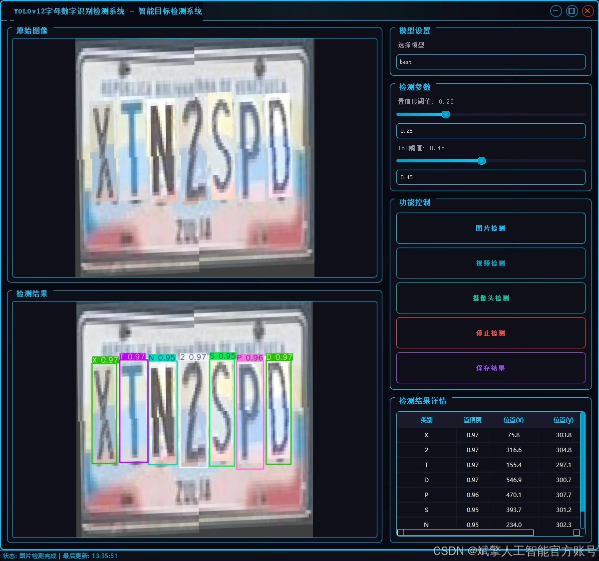
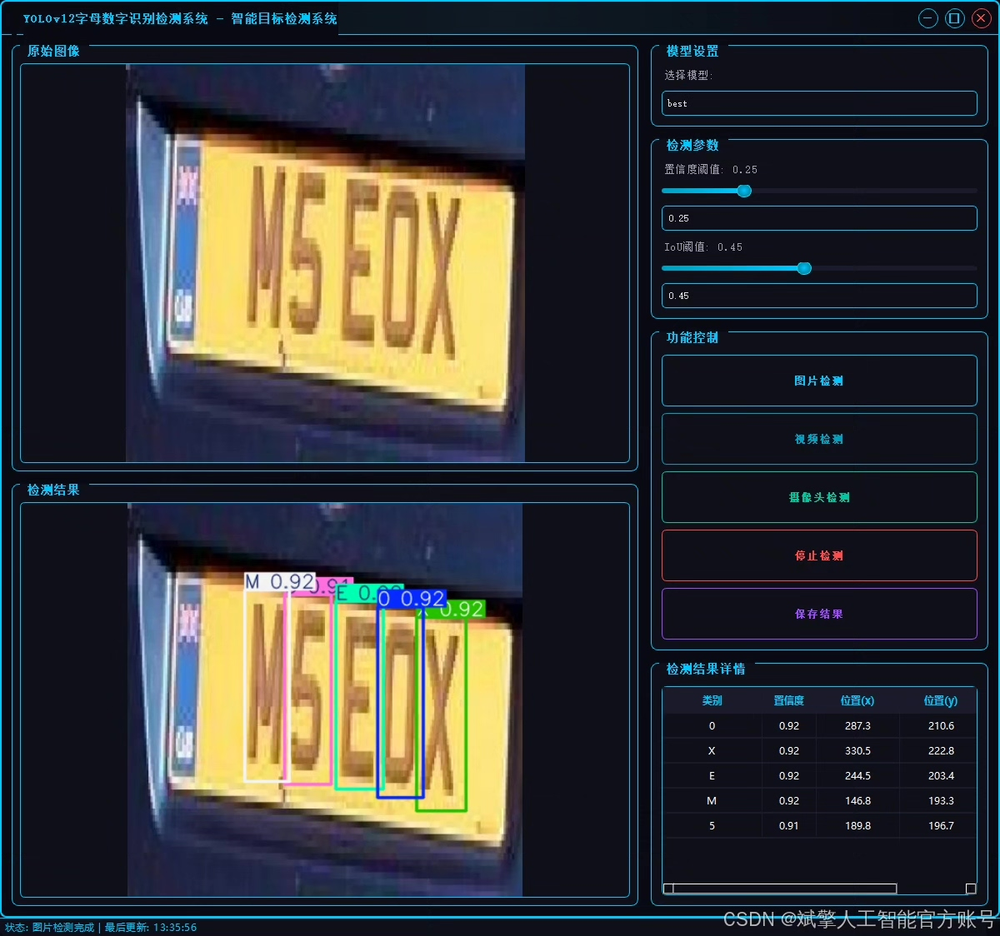
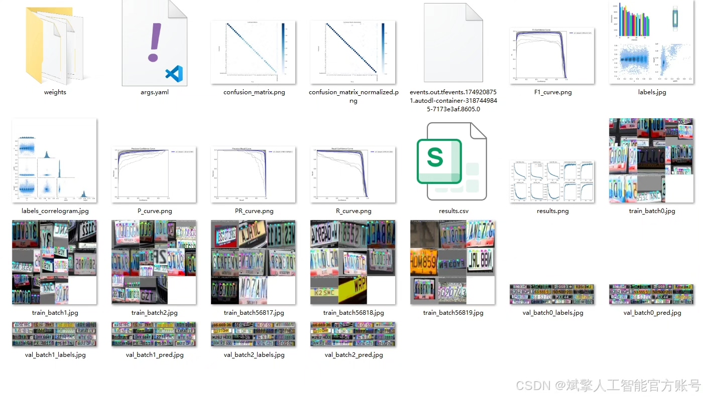
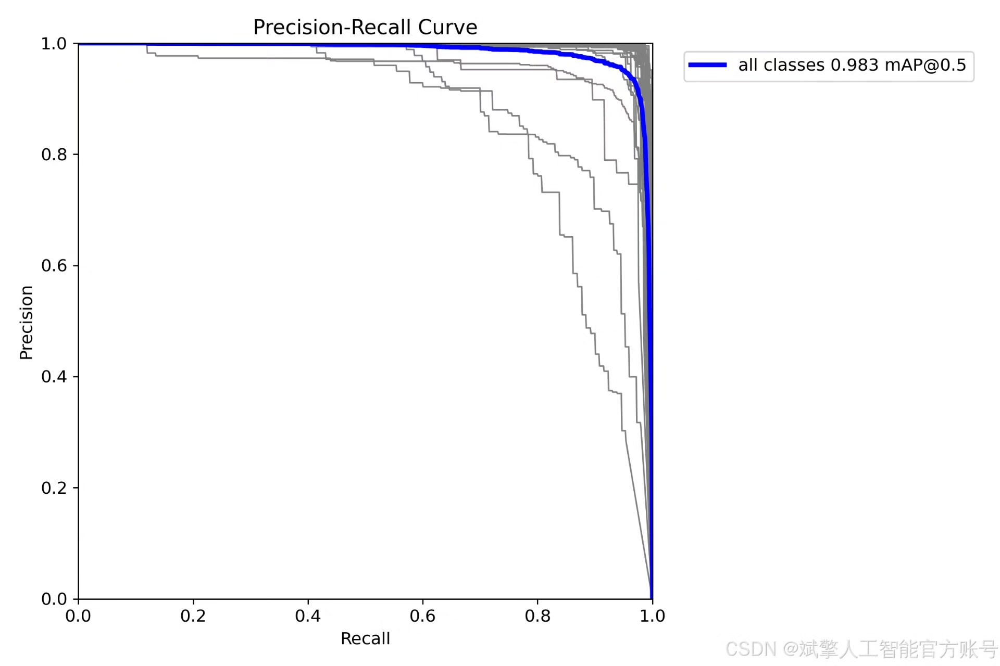
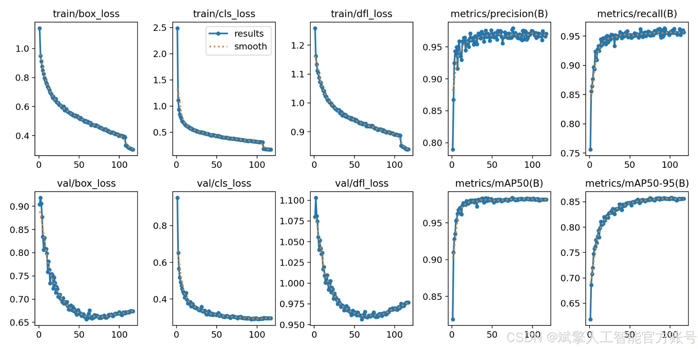
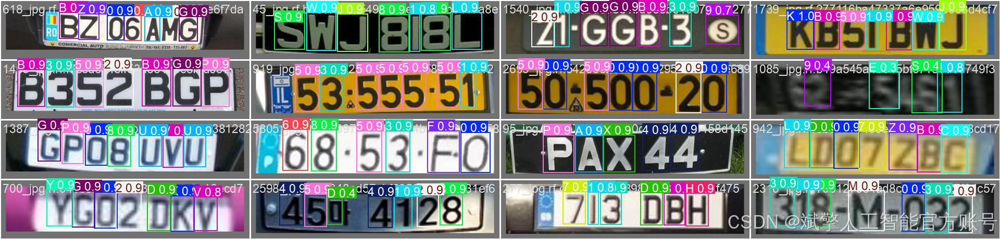
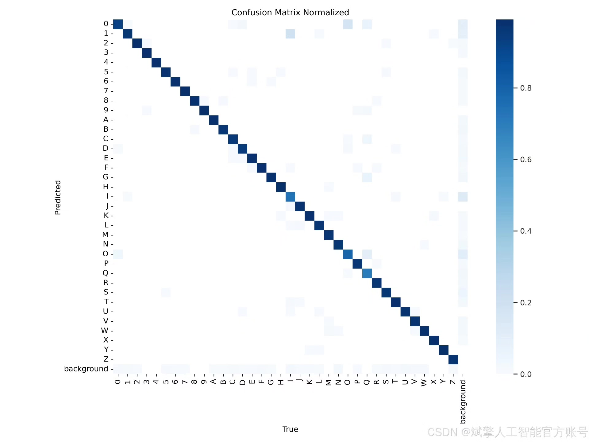

# YOLOv12 Alphanumeric Recognition System

## Body

YOLOv12 Letter and Digit Recognition System Based on Deep Learning YOLOv12+YOLO Dataset+UI Interface+Login/Registration Interface+Python Project Source Code+Model

This paper designs and implements a letter and digit recognition detection system based on the YOLOv12 deep learning model. The system can efficiently and accurately detect and recognize characters in images, including numbers 0-9 and letters A-Z. The system uses YOLOv12 as the core detection framework, combined with a custom YOLO format dataset for training and optimization. The training set contains 4245 images, the validation set 1221 images, and the test set 610 images. In addition, the system is equipped with a user-friendly UI interface that supports login and registration functions. Experimental results show that the system has high detection accuracy and robustness on the test set, meeting the needs of letter and digit recognition in real scenarios. This paper details the system architecture, dataset construction, model training, and interface design, and provides complete Python project source code and pre-trained models, providing a reproducible solution for related research.

✅ User Login/Registration: Supports password detection and security verification.
✅ Three detection modes: Based on the YOLOv12 model, supporting image, video, and real-time camera detection, accurate target recognition.
✅ Dual-screen comparison: Displaying the original scene and detection results on the same screen.
✅ Data visualization: Real-time table displaying the category, confidence, and coordinates of detected targets.
✅ Intelligent parameter adjustment: Providing a confidence slide bar to dynamically optimize detection accuracy, adapting to different scene requirements.
✅ Sci-fi style interactive interface: Dark theme combined with dynamic light effects, reducing visual fatigue and improving operational experience.

## Images

## Payment

Here is a pay link on Stripe ( https://buy.stripe.com/3cs8yP7sY87d0vu9AB ). Please contact me lonlonago@foxmail.com after funding $89, and I will send you a complete data files , thank you!

